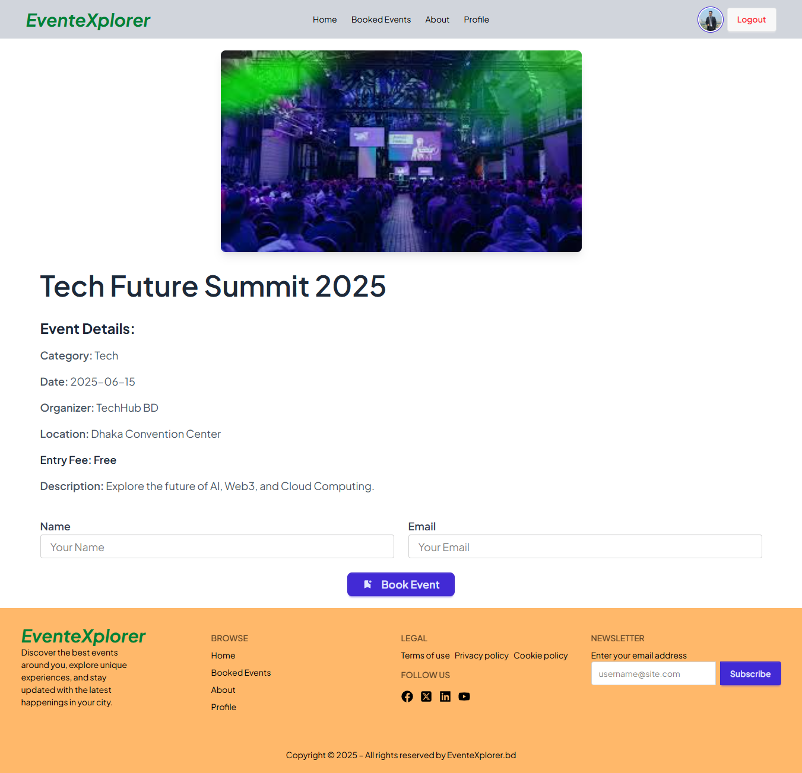
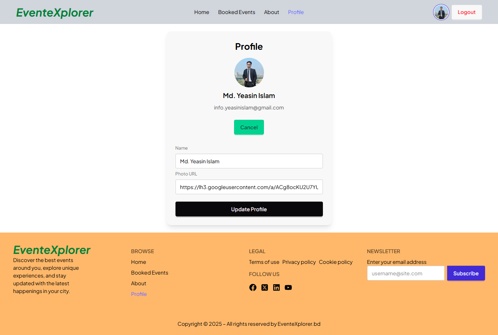

# 🎉 EventeXplorer

Welcome to **EventeXplorer** – a fun and modern web app that helps people discover, explore, and book awesome events, all in one place.

## 🌐 Live Site

👉 [Visit EventeXplorer-Netlify](https://event-explorer-catagori-jesmine-a9.netlify.app)
👉 [Visit EventeXplorer-Surge](http://event-explorer-catagori-jesmine-a9.surge.sh)

---


## 🎯 Purpose

EventeXplorer is built to make it easy for users to:

- Browse and search for different events
- See full details about an event (date, place, price, etc.)
- Book events they’re interested in
- Manage their bookings in their own profile
- Read what others say in testimonials
- Find answers in the FAQs

Whether you're looking for concerts, workshops, or tech meetups — EventeXplorer brings the experience to your fingertips.

---

## 🚀 Key Features

- 🧭 **Explore Events**: Scroll through events and find ones you love
- 📄 **Event Details Page**: Get all the info you need before booking
- 🔐 **User Login & Signup**: Secure login and registration using Firebase
- ✅ **Protected Pages**: Only logged-in users can book and view their bookings
- 📚 **Booking System**: Save and view your booked events
- 💬 **Testimonials Section**: Read real reviews from happy users
- 📊 **Cool Animated Stats**: See live event numbers using CountUp
- 🎠 **Smooth Image Sliders**: Swiper for beautiful visuals
- 🍞 **Toast Alerts**: Clean and simple notifications

---

## 🔧 Tools & Technologies Used

| Area            | Tech Used                              |
| --------------- | -------------------------------------- |
| Core            | React 19, Vite                         |
| Routing         | React Router                           |
| Styling         | Tailwind CSS, DaisyUI                  |
| Authentication  | Firebase                               |
| UI Enhancements | React Hot Toast, React CountUp, Swiper |
| Metadata        | React Helmet Async                     |
| Icons           | React Icons                            |

---

## 📦 NPM Packages Used

```bash
npm install react react-dom react-router-dom
npm install tailwindcss daisyui
npm install firebase
npm install react-hot-toast
npm install react-countup
npm install swiper
npm install react-helmet-async
npm install react-icons
```

---


## 💻 How to Run Locally

### 1. Clone the repository

```
bash

https://github.com/yeasin-islam/event-explorer.git

```
### 2. Install dependencies

```
bash

npm install

```

### 3. Setup Firebase

- Create a Firebase project in Firebase Console
- Enable Authentication (Email/Password & Google)
- Setup Firestore and Storage
- Add your Firebase config in src/firebase/firebaseConfig.js

### 4. Run the development server

```
base

npm run dev

```

### ☁ Deployment

- Netlify Hosting (Primary)

- Surge.sh (Alternative)

### 📦 Dependencies (from package.json)

```
react
react-router-dom
vite
firebase
tailwindcss
daisyui
lottie-react
React CountUp
react-hot-toast
swiper
```

---

## 📸 Preview

Here’s a quick look at EventeXplorer in action:


**Home Page with featured events and navigation**

---


**Detailed event view for easy booking**

---


**User profile showing booked events**

---

## 👨‍💻 Developer

### Md. Yeasin Islam
🔗 [LinkedIn Profile](https://www.linkedin.com/in/yeasin-islam75)

